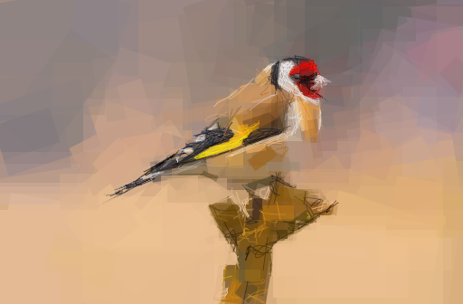

# primitive.js

A JavaScript re-creation of the [primitive.lol](http://primitive.lol/) application.

This project works on the ondras/primitive.js, and you can learn more about primitive.js in [primitive.js](https://github.com/ondras/primitive.js)

## What is the difference between this project and ondras/primitive.js

This project works on the ondras/primitive.js, adding some features to that.

- rotatable rectangle
- bezier and straight line
- packed by rollup.js and provide some interfaces used by your program
- no svg

## How does it look?

- use shapes including straight line, bezier and ratatable rectangle.

